Exploring Gapminder
================

Table of content
================

-   Determining attributes of gapminder (Smell test the data) [Here](#Header_1)
    -   What type is gapminder? [Here](#Subheader%201_1)
    -   What is the class on gapminder? [Here](#Subheader%201_2)
    -   How many variables/columns? [Here](#Subheader%201_3)
    -   How many rows/observations? [Here](#Subheader%201_4)
    -   Can you get these facts about “extent” or “size” in more than one way? Can you imagine different functions being useful in different contexts? [Here](#Subheader%201_5)
    -   What data type is each variable? [Here](#Subheader%201_5)
-   Exploring individual variables [Here](#Header_2)
    -   What are possible values (or range, whichever is appropriate) of each variable?[Here](#Subheader%202_1)
    -   What values are typical? What’s the spread? What’s the distribution?[Here](#Subheader%202_2)
-   Exploring various plot types [Here](#Header_3)
    -   A scatterplot of two quantitative variables [Here](#Subheader%203_1)
    -   A plot of one quantitative variable. Maybe a histogram or densityplot or frequency polygon [Here](#Subheader%203_2)
    -   A plot of one quantitative variable and one categorical. Maybe boxplots for several continents or countries [Here](#Subheader%203_3)

<a name="Header_1"> </a>

Determining attributes of gapminder (Smell test the data)
=========================================================

Loading the libraries

``` r
library(gapminder)
library(tidyverse)
library(ggplot2)
```

<a name="Subheader 1_1"> </a>

Q1) What type is gapminder?

``` r
typeof(gapminder)
```

    ## [1] "list"

<a name="Subheader 1_2"> </a>

Q2) What is the class on gapminder

``` r
class(gapminder)
```

    ## [1] "tbl_df"     "tbl"        "data.frame"

<a name="Subheader 1_3"> </a>

Q3) How many variables/columns?

``` r
ncol(gapminder)
```

    ## [1] 6

<a name="Subheader 1_4"> </a>

Q4) How many rows/observations?

``` r
nrow(gapminder)
```

    ## [1] 1704

<a name="Subheader 1_5"> </a>

Q5) Can you get these facts about “extent” or “size” in more than one way? Can you imagine different functions being useful in different contexts?

``` r
#way 1 using dim command
dim(gapminder)[1] #Rows
```

    ## [1] 1704

``` r
dim(gapminder)[2] #Coloumns
```

    ## [1] 6

``` r
#way two using length and transpose command
length(transpose(gapminder)) #Rows
```

    ## [1] 1704

``` r
length(gapminder)  #Coloumns
```

    ## [1] 6

<a name="Subheader 1_6"> </a>

Q6) What data type is each variable?

``` r
sapply(gapminder,typeof)
```

    ##   country continent      year   lifeExp       pop gdpPercap 
    ## "integer" "integer" "integer"  "double" "integer"  "double"

<a name="Header_2"> </a>

Exploring individual variables
==============================

<a name="Subheader 2_1"> </a>

Q1) What are possible values (or range, whichever is appropriate) of each variable?

``` r
max <- sapply(select(gapminder,year,lifeExp,pop,gdpPercap),max)
min <- sapply(select(gapminder,year,lifeExp,pop,gdpPercap),min)
#Range of Years
c(max[1],min[1])
```

    ## year year 
    ## 2007 1952

``` r
#Range of LifeExp
c(max[2],min[2])
```

    ## lifeExp lifeExp 
    ##  82.603  23.599

``` r
#Range of Pop
c(max[3],min[3])
```

    ##        pop        pop 
    ## 1318683096      60011

``` r
#Range of gdpPercap
c(max[4],min[4])
```

    ##   gdpPercap   gdpPercap 
    ## 113523.1329    241.1659

``` r
table(gapminder$country)
```

    ## 
    ##              Afghanistan                  Albania                  Algeria 
    ##                       12                       12                       12 
    ##                   Angola                Argentina                Australia 
    ##                       12                       12                       12 
    ##                  Austria                  Bahrain               Bangladesh 
    ##                       12                       12                       12 
    ##                  Belgium                    Benin                  Bolivia 
    ##                       12                       12                       12 
    ##   Bosnia and Herzegovina                 Botswana                   Brazil 
    ##                       12                       12                       12 
    ##                 Bulgaria             Burkina Faso                  Burundi 
    ##                       12                       12                       12 
    ##                 Cambodia                 Cameroon                   Canada 
    ##                       12                       12                       12 
    ## Central African Republic                     Chad                    Chile 
    ##                       12                       12                       12 
    ##                    China                 Colombia                  Comoros 
    ##                       12                       12                       12 
    ##         Congo, Dem. Rep.              Congo, Rep.               Costa Rica 
    ##                       12                       12                       12 
    ##            Cote d'Ivoire                  Croatia                     Cuba 
    ##                       12                       12                       12 
    ##           Czech Republic                  Denmark                 Djibouti 
    ##                       12                       12                       12 
    ##       Dominican Republic                  Ecuador                    Egypt 
    ##                       12                       12                       12 
    ##              El Salvador        Equatorial Guinea                  Eritrea 
    ##                       12                       12                       12 
    ##                 Ethiopia                  Finland                   France 
    ##                       12                       12                       12 
    ##                    Gabon                   Gambia                  Germany 
    ##                       12                       12                       12 
    ##                    Ghana                   Greece                Guatemala 
    ##                       12                       12                       12 
    ##                   Guinea            Guinea-Bissau                    Haiti 
    ##                       12                       12                       12 
    ##                 Honduras         Hong Kong, China                  Hungary 
    ##                       12                       12                       12 
    ##                  Iceland                    India                Indonesia 
    ##                       12                       12                       12 
    ##                     Iran                     Iraq                  Ireland 
    ##                       12                       12                       12 
    ##                   Israel                    Italy                  Jamaica 
    ##                       12                       12                       12 
    ##                    Japan                   Jordan                    Kenya 
    ##                       12                       12                       12 
    ##         Korea, Dem. Rep.              Korea, Rep.                   Kuwait 
    ##                       12                       12                       12 
    ##                  Lebanon                  Lesotho                  Liberia 
    ##                       12                       12                       12 
    ##                    Libya               Madagascar                   Malawi 
    ##                       12                       12                       12 
    ##                 Malaysia                     Mali               Mauritania 
    ##                       12                       12                       12 
    ##                Mauritius                   Mexico                 Mongolia 
    ##                       12                       12                       12 
    ##               Montenegro                  Morocco               Mozambique 
    ##                       12                       12                       12 
    ##                  Myanmar                  Namibia                    Nepal 
    ##                       12                       12                       12 
    ##              Netherlands              New Zealand                Nicaragua 
    ##                       12                       12                       12 
    ##                    Niger                  Nigeria                   Norway 
    ##                       12                       12                       12 
    ##                     Oman                 Pakistan                   Panama 
    ##                       12                       12                       12 
    ##                 Paraguay                     Peru              Philippines 
    ##                       12                       12                       12 
    ##                   Poland                 Portugal              Puerto Rico 
    ##                       12                       12                       12 
    ##                  Reunion                  Romania                   Rwanda 
    ##                       12                       12                       12 
    ##    Sao Tome and Principe             Saudi Arabia                  Senegal 
    ##                       12                       12                       12 
    ##                   Serbia             Sierra Leone                Singapore 
    ##                       12                       12                       12 
    ##          Slovak Republic                 Slovenia                  Somalia 
    ##                       12                       12                       12 
    ##             South Africa                    Spain                Sri Lanka 
    ##                       12                       12                       12 
    ##                    Sudan                Swaziland                   Sweden 
    ##                       12                       12                       12 
    ##              Switzerland                    Syria                   Taiwan 
    ##                       12                       12                       12 
    ##                 Tanzania                 Thailand                     Togo 
    ##                       12                       12                       12 
    ##      Trinidad and Tobago                  Tunisia                   Turkey 
    ##                       12                       12                       12 
    ##                   Uganda           United Kingdom            United States 
    ##                       12                       12                       12 
    ##                  Uruguay                Venezuela                  Vietnam 
    ##                       12                       12                       12 
    ##       West Bank and Gaza              Yemen, Rep.                   Zambia 
    ##                       12                       12                       12 
    ##                 Zimbabwe 
    ##                       12

``` r
table(gapminder$continent)
```

    ## 
    ##   Africa Americas     Asia   Europe  Oceania 
    ##      624      300      396      360       24

Another method using function range (simple!!!)

``` r
sapply(select(gapminder,year,lifeExp,pop,gdpPercap),range)
```

    ##      year lifeExp        pop   gdpPercap
    ## [1,] 1952  23.599      60011    241.1659
    ## [2,] 2007  82.603 1318683096 113523.1329

Another method using summary (Yay!!!)

``` r
summary(gapminder)
```

    ##         country        continent        year         lifeExp     
    ##  Afghanistan:  12   Africa  :624   Min.   :1952   Min.   :23.60  
    ##  Albania    :  12   Americas:300   1st Qu.:1966   1st Qu.:48.20  
    ##  Algeria    :  12   Asia    :396   Median :1980   Median :60.71  
    ##  Angola     :  12   Europe  :360   Mean   :1980   Mean   :59.47  
    ##  Argentina  :  12   Oceania : 24   3rd Qu.:1993   3rd Qu.:70.85  
    ##  Australia  :  12                  Max.   :2007   Max.   :82.60  
    ##  (Other)    :1632                                                
    ##       pop              gdpPercap       
    ##  Min.   :6.001e+04   Min.   :   241.2  
    ##  1st Qu.:2.794e+06   1st Qu.:  1202.1  
    ##  Median :7.024e+06   Median :  3531.8  
    ##  Mean   :2.960e+07   Mean   :  7215.3  
    ##  3rd Qu.:1.959e+07   3rd Qu.:  9325.5  
    ##  Max.   :1.319e+09   Max.   :113523.1  
    ## 

<a name="Subheader 2_2"> </a>

Q2) What values are typical? What’s the spread? What’s the distribution?

For findinding the distribution and typical values graphs are plotted, from that peak and spread can be visualised. Peak represent typical values.

``` r
#Exploring continents
ggplot(gapminder, aes(x = continent)) + geom_bar()
```


``` r
#Exploring distribution of population (spread and typical values)
#population based on entire glob
ggplot(gapminder, aes(x = log10(pop))) + geom_histogram()
```

    ## `stat_bin()` using `bins = 30`. Pick better value with `binwidth`.


``` r
#Polpulation contribution by each continent
ggplot(gapminder, aes(x = log10(pop), fill = continent )) + geom_histogram()
```

    ## `stat_bin()` using `bins = 30`. Pick better value with `binwidth`.

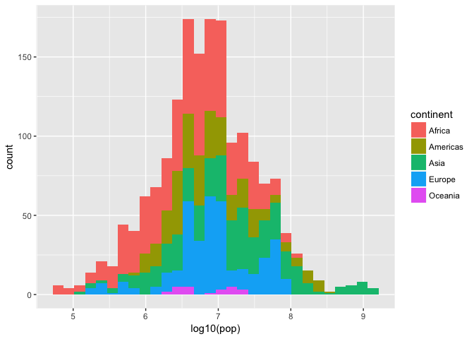

``` r
#Polpulation distribution in each continent
#Africa
gapminder %>% 
  filter(continent == "Africa") %>% 
  ggplot(aes(x = log10(pop))) + geom_histogram()
```

    ## `stat_bin()` using `bins = 30`. Pick better value with `binwidth`.

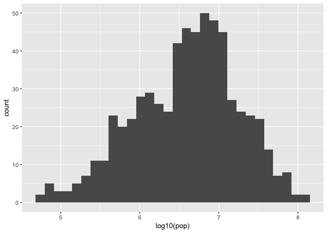

``` r
#America
gapminder %>% 
  filter(continent == "Americas") %>% 
  ggplot(aes(x = log10(pop))) + geom_histogram()
```

    ## `stat_bin()` using `bins = 30`. Pick better value with `binwidth`.

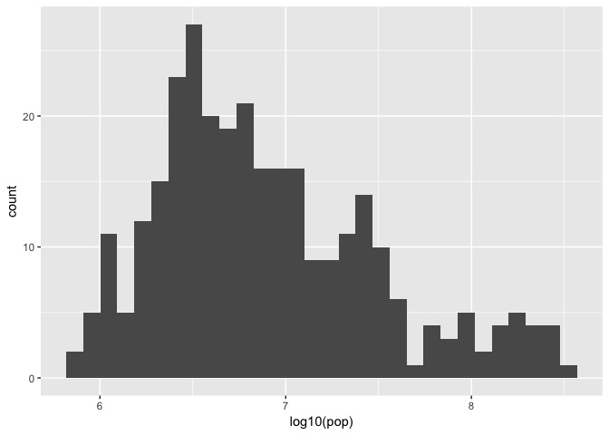

``` r
#Asia
gapminder %>% 
  filter(continent == "Asia") %>% 
  ggplot(aes(x = log10(pop))) + geom_histogram()
```

    ## `stat_bin()` using `bins = 30`. Pick better value with `binwidth`.

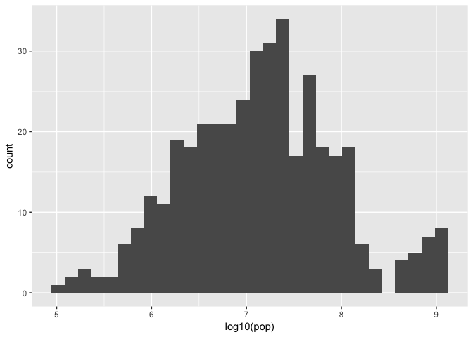

``` r
#Europe
gapminder %>% 
  filter(continent == "Europe") %>% 
  ggplot(aes(x = log10(pop))) + geom_histogram()
```

    ## `stat_bin()` using `bins = 30`. Pick better value with `binwidth`.

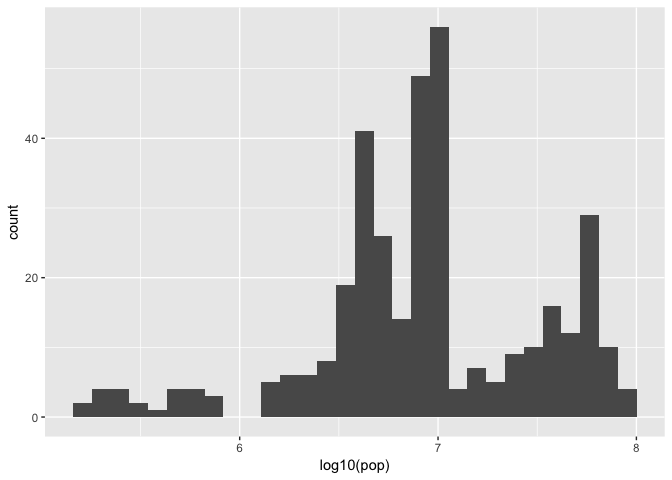

``` r
#Oceania
gapminder %>% 
  filter(continent == "Oceania") %>% 
  ggplot(aes(x = log10(pop))) + geom_histogram()
```

    ## `stat_bin()` using `bins = 30`. Pick better value with `binwidth`.

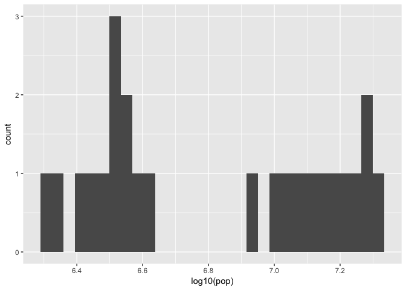

``` r
#Exploring distribution of lifeExp (spread and typical values)
#lifeExp based on entire glob
ggplot(gapminder, aes(x = lifeExp)) + geom_density()
```

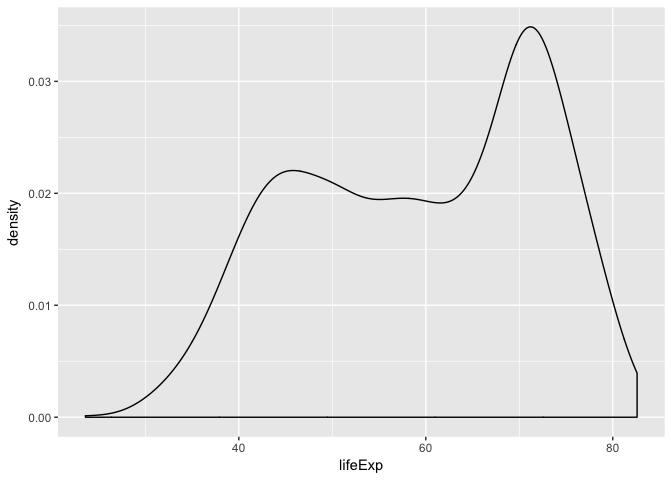

``` r
#lifeExp contribution by each continent
ggplot(gapminder, aes(x = lifeExp, color = continent)) + geom_density()
```


``` r
#Exploring distribution of gdpPercap (spread and typical values)
#gdpPercap based on entire glob
ggplot(gapminder, aes(x = log10(gdpPercap))) + geom_density()
```

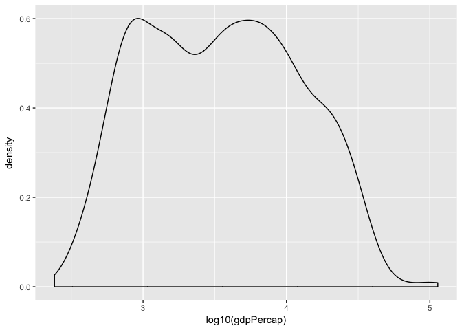

``` r
#gdpPercap ontribution by each continent
ggplot(gapminder, aes(x = log10(gdpPercap), color = continent)) + geom_density()
```


<a name="Header_3"> </a>

Exploring various plot types
============================

<a name="Subheader 3_1"> </a>

Q1) A scatterplot of two quantitative variables.

``` r
#Scatter plot of log10(total gdp) vs lifeexp for 5 countries
gapminder %>% 
  filter(country %in% c("India","China","Canada","Australia","Japan")) %>% 
  mutate(gdp = gdpPercap * pop) %>% 
  ggplot(aes(x = log10(gdp), y = lifeExp)) +
  geom_point(aes(color = country))
```


``` r
#Scatter plot for mean of log10(pop) vs mean of lifeExp for all the countries
gapminder %>% 
  group_by(country) %>% 
  summarise(mean_pop=log10(mean(pop)), mean_life=mean(lifeExp)) %>% 
  ggplot(aes(x=mean_pop, y=mean_life)) + geom_point()
```

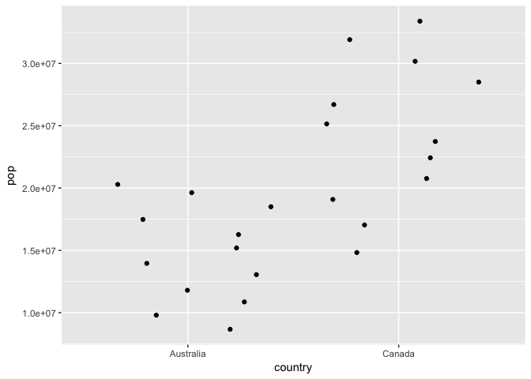

<a name="Subheader 3_2"> </a>

Q2) A plot of one quantitative variable. Maybe a histogram or densityplot or frequency polygon.

``` r
#Histogram for log10(pop) for 5 countries 
gapminder %>% 
  filter(country %in% c("India","China","Canada","Australia","Japan")) %>% 
  ggplot(aes(x = log10(pop), color=country)) + geom_histogram()
```

    ## `stat_bin()` using `bins = 30`. Pick better value with `binwidth`.

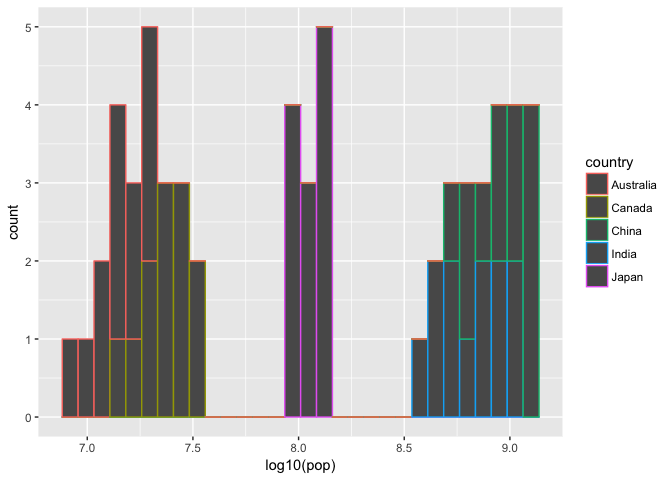

<a name="Subheader 3_3"> </a>

Q3) A plot of one quantitative variable and one categorical. Maybe boxplots for several continents or countries.

``` r
#Boxplot for 5 country and their population
gapminder %>% 
  filter(country %in% c("India","China","Canada","Australia","Japan")) %>% 
  ggplot(aes(x=country,y=log10(pop))) + geom_boxplot()
```

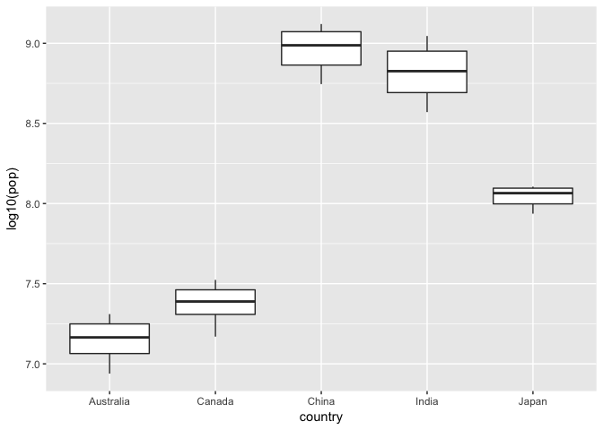

``` r
#Jitter plot for 2 country and their population
gapminder %>% 
  filter(country %in% c("Canada", "Australia")) %>% 
  ggplot(aes(x = country, y = pop)) + geom_jitter()
```

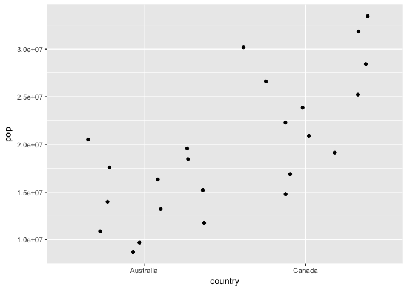

``` r
#Box plot for log10(total gdp) for all the continents
gapminder %>% 
  mutate(gdp = gdpPercap * pop) %>% 
  ggplot(aes(x=continent, y = log10(gdp))) + geom_boxplot()
```

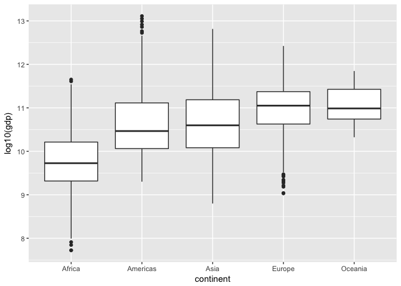
