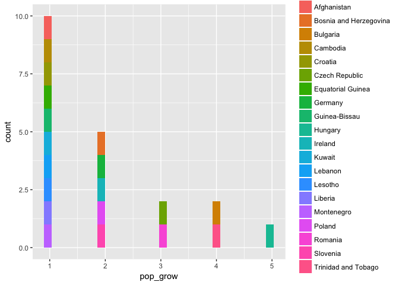

Hw\_03
================

Content table
=============

-   Get the maximum and minimum of GDP per capita for all continents [Here](#Header1)
-   Look at the spread of GDP per capita within the continents [Here](#Header2)
-   Compute a trimmed mean of life expectancy for different years. Or a weighted mean, weighting by population. Just try something other than the plain vanilla mean [here](#Header3)
-   How is life expectancy changing over time on different continents [Here](#Header4)
-   Report the absolute and/or relative abundance of countries with low life expectancy over time by continent: Compute some measure of worldwide life expectancy – you decide – a mean or median or some other quantile or perhaps your current age. Then determine how many countries on each continent have a life expectancy less than this benchmark, for each year [Here](#Header5)
-   Find countries with interesting stories. Open-ended and, therefore, hard. Promising but unsuccessful attempts are encouraged. This will generate interesting questions to follow up on in class [Here](#Header6)

Loading the libraries

``` r
library(gapminder)
library(tidyverse)
```

<a name="Header1"> </a>

Task list:
==========

1.  Get the maximum and minimum of GDP per capita for all continents

What i did in Nutshell:

-   Grouped the data by continent
-   Summarized the data based on minimum gdpPercap for each country
-   Plotted normal table and one from knitr package (clearly knitr is much better so just used it from now on)
-   Plotted a box plot

``` r
min_gdppercap <- gapminder %>% 
  group_by(continent) %>% 
  summarize(min_gdPercap = min(gdpPercap))
table(min_gdppercap)
```

    ##           min_gdPercap
    ## continent  241.1658765 331 973.5331948 1201.637154 10039.59564
    ##   Africa             1   0           0           0           0
    ##   Americas           0   0           0           1           0
    ##   Asia               0   1           0           0           0
    ##   Europe             0   0           1           0           0
    ##   Oceania            0   0           0           0           1

``` r
knitr::kable(min_gdppercap)
```

| continent |  min\_gdPercap|
|:----------|--------------:|
| Africa    |       241.1659|
| Americas  |      1201.6372|
| Asia      |       331.0000|
| Europe    |       973.5332|
| Oceania   |     10039.5956|

``` r
ggplot(min_gdppercap,aes(x=continent,y=min_gdPercap)) + geom_boxplot()
```


<a name="Header2"> </a>

Q2) Look at the spread of GDP per capita within the continents.

-   First the data is extracted in such a way that we have mean value for gdpPerap for each country for over all years
-   This data is arranged based on continents
-   Table is formed based on this data
-   To visualize spread histograms are plotted for respective continents

``` r
spread <- gapminder %>%
  group_by(country,continent) %>%
  summarize(gdp_avg=mean(gdpPercap))
spread <- arrange(spread,continent)
knitr::kable(head(spread)) #only head is printed as the table is too large
```

| country      | continent |   gdp\_avg|
|:-------------|:----------|----------:|
| Algeria      | Africa    |  4426.0260|
| Angola       | Africa    |  3607.1005|
| Benin        | Africa    |  1155.3951|
| Botswana     | Africa    |  5031.5036|
| Burkina Faso | Africa    |   843.9907|
| Burundi      | Africa    |   471.6630|

``` r
ggplot(spread,aes(x=gdp_avg))  + facet_wrap(~ continent) + geom_histogram()
```

    ## `stat_bin()` using `bins = 30`. Pick better value with `binwidth`.


<a name="Header3"> </a>

Q3) Compute a trimmed mean of life expectancy for different years. Or a weighted mean, weighting by population. Just try something other than the plain vanilla mean.

-   The data was grouped based on year
-   weighted mean for all the years were taken and summarized
-   Table is plotted
-   The data is visualized by plotting a line plot

``` r
Weighted_life <- gapminder %>% 
  group_by(year) %>% 
  summarize(weighted_lE_by_pop = weighted.mean(lifeExp,pop))
knitr::kable(Weighted_life)
```

|  year|  weighted\_lE\_by\_pop|
|-----:|----------------------:|
|  1952|               48.94424|
|  1957|               52.12189|
|  1962|               52.32438|
|  1967|               56.98431|
|  1972|               59.51478|
|  1977|               61.23726|
|  1982|               62.88176|
|  1987|               64.41635|
|  1992|               65.64590|
|  1997|               66.84934|
|  2002|               67.83904|
|  2007|               68.91909|

``` r
ggplot(Weighted_life,aes(year,weighted_lE_by_pop)) + geom_line()
```


<a name="Header4"> </a>

Q4) How is life expectancy changing over time on different continents?

-   The data was grouped based on years and continent
-   weighted mean for all the years were taken and summarized
-   as the data was also grouped based on continent we get the weighted average by years for each continent
-   the resultant data is arranged based on continents
-   Table is plotted
-   The data is visualized by plotting a line plot

``` r
Weighted_life_cont <- gapminder %>% 
  group_by(year,continent) %>% 
  summarize(weighted_lE_by_pop = weighted.mean(lifeExp,pop))
Weighted_life_cont <- arrange(Weighted_life_cont,continent)
knitr::kable(Weighted_life_cont)
```

|  year| continent |  weighted\_lE\_by\_pop|
|-----:|:----------|----------------------:|
|  1952| Africa    |               38.79973|
|  1957| Africa    |               40.94031|
|  1962| Africa    |               43.09925|
|  1967| Africa    |               45.17721|
|  1972| Africa    |               47.21229|
|  1977| Africa    |               49.20883|
|  1982| Africa    |               51.01744|
|  1987| Africa    |               52.82479|
|  1992| Africa    |               53.37292|
|  1997| Africa    |               53.28327|
|  2002| Africa    |               53.30314|
|  2007| Africa    |               54.56441|
|  1952| Americas  |               60.23599|
|  1957| Americas  |               62.01806|
|  1962| Americas  |               63.43706|
|  1967| Americas  |               64.50630|
|  1972| Americas  |               65.70490|
|  1977| Americas  |               67.60591|
|  1982| Americas  |               69.19264|
|  1987| Americas  |               70.35814|
|  1992| Americas  |               71.72177|
|  1997| Americas  |               73.19154|
|  2002| Americas  |               74.24736|
|  2007| Americas  |               75.35668|
|  1952| Asia      |               42.94114|
|  1957| Asia      |               47.28835|
|  1962| Asia      |               46.57369|
|  1967| Asia      |               53.88261|
|  1972| Asia      |               57.52159|
|  1977| Asia      |               59.55648|
|  1982| Asia      |               61.57472|
|  1987| Asia      |               63.53710|
|  1992| Asia      |               65.14874|
|  1997| Asia      |               66.77092|
|  2002| Asia      |               68.13732|
|  2007| Asia      |               69.44386|
|  1952| Europe    |               64.90540|
|  1957| Europe    |               66.89364|
|  1962| Europe    |               68.45957|
|  1967| Europe    |               69.54963|
|  1972| Europe    |               70.46884|
|  1977| Europe    |               71.53989|
|  1982| Europe    |               72.56247|
|  1987| Europe    |               73.44717|
|  1992| Europe    |               74.44273|
|  1997| Europe    |               75.70849|
|  2002| Europe    |               77.02232|
|  2007| Europe    |               77.89057|
|  1952| Oceania   |               69.17040|
|  1957| Oceania   |               70.31693|
|  1962| Oceania   |               70.98808|
|  1967| Oceania   |               71.17848|
|  1972| Oceania   |               71.92273|
|  1977| Oceania   |               73.25684|
|  1982| Oceania   |               74.58291|
|  1987| Oceania   |               75.98107|
|  1992| Oceania   |               77.35788|
|  1997| Oceania   |               78.61843|
|  2002| Oceania   |               80.16006|
|  2007| Oceania   |               81.06215|

``` r
ggplot(Weighted_life_cont,aes(year,weighted_lE_by_pop,color=continent)) + geom_line()
```


<a name="Header5"> </a>

Q5) Report the absolute and/or relative abundance of countries with low life expectancy over time by continent: Compute some measure of worldwide life expectancy – you decide – a mean or median or some other quantile or perhaps your current age. Then determine how many countries on each continent have a life expectancy less than this benchmark, for each year.

-   The threshold selected is median
-   Grouped the data based on continents and years
-   assigned score 1 if lifeExp more than threshold or 0 otherwise
-   Assigned 1 to each country (done this to count the total number of country in each continent)
-   summarized the data based on percentage of countries have lifeExp more than the threshold
-   arranged the countries based on continents
-   Provided the summary of percentage
-   provided tail of the table as data is too large
-   provided a visualisation using line plot

``` r
lf_measure <- median(gapminder$lifeExp)
life_threshold <-gapminder %>% 
  group_by(year,continent) %>% 
  mutate(size=c(1,0)[(lifeExp<lf_measure) + 1]) %>%
  mutate(size_con=c(1,0)[(lifeExp<0) + 1]) %>% 
  #summarise(percentage = sum(size)) %>% 
  summarise(percentage = sum(size)/sum(size_con)*100) %>% 
  arrange(continent)
summary(life_threshold$percentage)
```

    ##    Min. 1st Qu.  Median    Mean 3rd Qu.    Max. 
    ##    0.00   23.77   82.42   65.79  100.00  100.00

``` r
knitr::kable(tail(life_threshold))
```

|  year| continent |  percentage|
|-----:|:----------|-----------:|
|  1982| Oceania   |         100|
|  1987| Oceania   |         100|
|  1992| Oceania   |         100|
|  1997| Oceania   |         100|
|  2002| Oceania   |         100|
|  2007| Oceania   |         100|

``` r
ggplot(life_threshold,aes(year,percentage,color=continent)) + geom_line()
```


<a name="Header6"> </a>

Q6) Find countries with interesting stories. Open-ended and, therefore, hard. Promising but unsuccessful attempts are encouraged. This will generate interesting questions to follow up on in class.

First interesting story about gdP growth!!!

Why its interesting is because negative gdp growth corresponds to decrease in the standard of living and poor facilities and may be due to unavailability of technologies, jobs etc.

What i did in nutshell:

-   Grouped the data based on countries
-   Found the difference in gdp for consecutive years
-   Assigned value 1 if its positive growth else 0
-   Switched the values of NA to 1
-   Summarized each country by summing up their number of time positive growth
-   sorted the resultant set
-   Found the number of time the negative growth
-   Provided the top 20 of table as the table is too long
-   Plotted just these 20 of set again to have a better visalisation

``` r
gdp_tren <-gapminder %>% 
  group_by(country) %>% 
  mutate(size=c(1,0)[((gdpPercap-lag(gdpPercap,1))<0) + 1])
gdp_tren$size[is.na(gdp_tren$size)] <- 1
gdp_tren <-summarize(gdp_tren,gdp_trend=sum(size))
gdp_tren[[1]] <- gdp_tren[[1]][order(gdp_tren[[2]],decreasing = FALSE)]
gdp_tren[[2]] <- sort(gdp_tren[[2]],decreasing = FALSE)
gdp_tren[[2]] <- 12 - gdp_tren[[2]]
#In here value of gdp_trend variable gives us the number of years with negative gdp Growth for the countries
#This gives the data for 12 years and out of which how many years each country had negative gdp growth
# if(0 %in% numbers(gdp_tren))  gdp_tren<- gdp_tren[ - which(gdp_trend(gdp_tren) == 0)]
# min_index <- which(gdp_tren$gdp_trend==median(gdp_tren$gdp_trend))
gdp_tren <- head(gdp_tren, 20)
knitr::kable(gdp_tren)
```

| country                  |  gdp\_trend|
|:-------------------------|-----------:|
| Central African Republic |           8|
| Congo, Dem. Rep.         |           8|
| Haiti                    |           7|
| Madagascar               |           7|
| Togo                     |           7|
| Kuwait                   |           6|
| Liberia                  |           6|
| Senegal                  |           6|
| Somalia                  |           6|
| Zambia                   |           6|
| Afghanistan              |           5|
| Angola                   |           5|
| Benin                    |           5|
| Comoros                  |           5|
| Djibouti                 |           5|
| Korea, Dem. Rep.         |           5|
| Niger                    |           5|
| Sudan                    |           5|
| Tanzania                 |           5|
| Venezuela                |           5|

``` r
ggplot(gdp_tren,aes(x=gdp_trend, color=country)) + geom_histogram() 
```

    ## `stat_bin()` using `bins = 30`. Pick better value with `binwidth`.


From the data shown above its interesting to see kuwait in the list of decreasing gdp as its one of the richest country.

Many other countries are expected as they are part of developing nations

Second interesting story about population growth!!!

The Reason why I think its interesting because if a country is having negative population growth then number of deaths are more than number of births which happens if the countries do not have proper medical facilities or very prone to natural disasters or due to war or some other major problem.

What i did in nutshell:

-   Grouped the data based on countries
-   Found the difference in population for consecutive years
-   Assigned value 1 if its positive growth else 0
-   Switched the values of NA to 1
-   Summarized each country by summing up their number of time positive growth
-   sorted the resultant set
-   Found the number of time the negative growth
-   Provided the head of the table as its too long
-   Plotted just the head of set again to have a better visalisation

``` r
pop_growth <-gapminder %>% 
  group_by(country) %>%
  mutate(size=c(1,0)[((pop-lag(pop,1))<0) + 1])
pop_growth$size[is.na(pop_growth$size)] <- 1
pop_growth <-summarize(pop_growth,pop_grow=sum(size))
pop_growth[[1]] <- pop_growth[[1]][order(pop_growth[[2]],decreasing = FALSE)]
pop_growth[[2]] <- sort(pop_growth[[2]],decreasing = FALSE)
pop_growth[[2]] <- 12 - pop_growth[[2]]
#In here value of pop_grow variable gives us the number of years with negative population Growth for the countries
#This gives the data for 12 years and out of which how many years each country had negative population growth
pop_growth <- head(pop_growth, 20)
knitr::kable(pop_growth)
```

| country                |  pop\_grow|
|:-----------------------|----------:|
| Hungary                |          5|
| Bulgaria               |          4|
| Trinidad and Tobago    |          4|
| Czech Republic         |          3|
| Romania                |          3|
| Bosnia and Herzegovina |          2|
| Germany                |          2|
| Ireland                |          2|
| Poland                 |          2|
| Slovenia               |          2|
| Afghanistan            |          1|
| Cambodia               |          1|
| Croatia                |          1|
| Equatorial Guinea      |          1|
| Guinea-Bissau          |          1|
| Kuwait                 |          1|
| Lebanon                |          1|
| Lesotho                |          1|
| Liberia                |          1|
| Montenegro             |          1|

``` r
ggplot(pop_growth,aes(x=pop_grow, color=country)) + geom_histogram() 
```

    ## `stat_bin()` using `bins = 30`. Pick better value with `binwidth`.



Its interesting that there are countries like Germany, ireland, kuwait in this list as they very prosperous countries in the contemporary world
