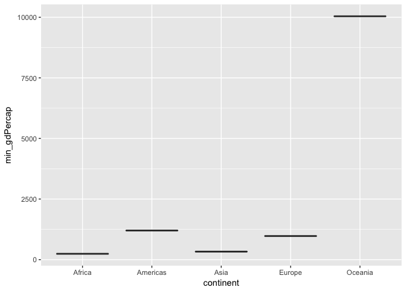

# Side_side

Get the maximum and minimum of GDP per capita for all continents

What i did in Nutshell:

- Grouped data by continent
- Summarized the data based on minimum gdpPercap for each country
- Plotted a box plot  

Loading the libraries

```r
library(gapminder)
library(tidyverse)
```

<div class="twoC">

continent    min_gdPercap
----------  -------------
Africa           241.1659
Americas        1201.6372
Asia             331.0000
Europe           973.5332
Oceania        10039.5956

<!-- -->

</div>
<div class="clearer"></div>

