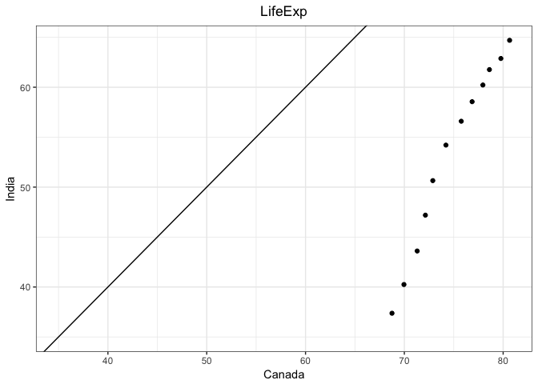
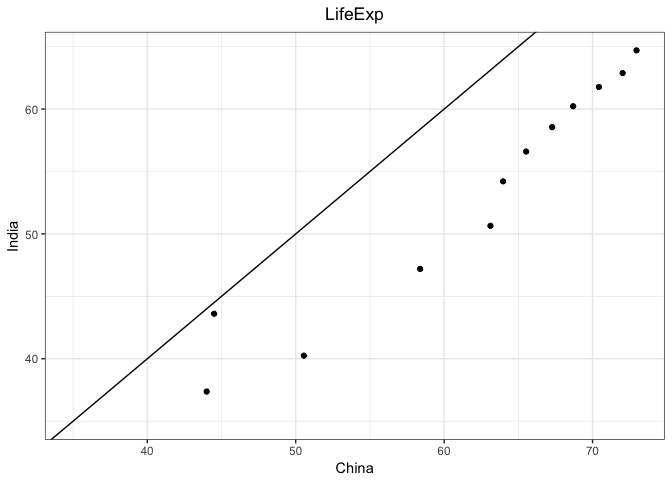
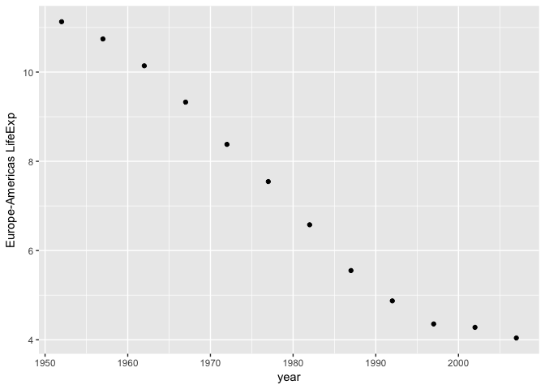
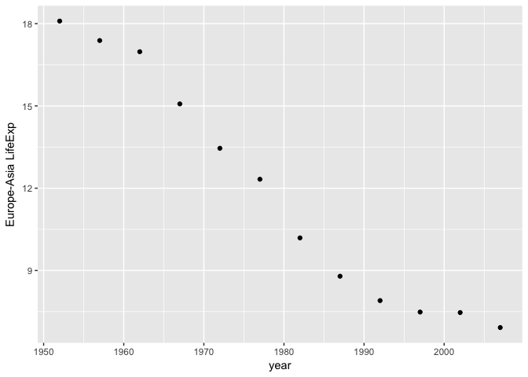

Hw\_04
================

Table of Content
================

-   General data reshaping and relationship to aggregation
    -   Make you own cheatsheet and Make you own cheatsheet and Make up a similar set of exercises for yourself, in the abstract or (even better) using Gapminder or other data, and solve them (Activity 1 and 5 combined)
    -   Make a tibble with one row per year and columns for life expectancy for two or more countries
    -   Compute some measure of life expectancy (mean? median? min? max?) for all possible combinations of continent and year. Reshape that to have one row per year and one variable for each continent
    -   Take that table (or a similar one for all continents) and reshape it so you have one row per year or per year \* continent combination.

``` r
library(gapminder)
library(tidyverse)
library(reshape2)
```

General data reshaping and relationship to aggregation
======================================================

Make you own cheatsheet and Make up a similar set of exercises for yourself, in the abstract or (even better) using Gapminder or other data, and solve them.
------------------------------------------------------------------------------------------------------------------------------------------------------------

Most used functions in tidyl and reshape2 for tidying and reshaping the data are:

| tdyl   | reshape2 |
|:-------|:---------|
| Gather | Melt     |
| Spread | dcast    |

Example set for displaying result form all four functions:

Data of Species recorded each day.

| day       |  wolf|  hare|  fox|
|:----------|-----:|-----:|----:|
| Monday    |     2|    20|    4|
| Tuesday   |     1|    25|    4|
| Wednesday |     3|    30|    4|

What each of the four mentioned functions will do is:

So **Gather** and **Melt** will take

| day       |  wolf|  hare|  fox|
|:----------|-----:|-----:|----:|
| Monday    |     2|    20|    4|
| Tuesday   |     1|    25|    4|
| Wednesday |     3|    30|    4|

to

| day       | species |  Count|
|:----------|:--------|------:|
| Monday    | wolf    |      2|
| Tuesday   | hare    |      1|
| Wednesday | fox     |      3|
| Monday    | wolf    |     20|
| Tuesday   | hare    |     25|
| Wednesday | fox     |     30|
| Monday    | wolf    |      4|
| Tuesday   | hare    |      4|
| Wednesday | fox     |      4|

While **Spread** and **dcast** will take it back to

| day       |  wolf|  hare|  fox|
|:----------|-----:|-----:|----:|
| Monday    |     2|    20|    4|
| Tuesday   |     1|    25|    4|
| Wednesday |     3|    30|    4|

Syntax used for Gather:


Example for Gather

``` r
gat <- gather(ex_set,key = 'species',value = 'Count',wolf,hare,fox)
knitr::kable(gat)
```

| day       | species |  Count|
|:----------|:--------|------:|
| Monday    | wolf    |      2|
| Tuesday   | wolf    |      1|
| Wednesday | wolf    |      3|
| Monday    | hare    |     20|
| Tuesday   | hare    |     25|
| Wednesday | hare    |     30|
| Monday    | fox     |      4|
| Tuesday   | fox     |      4|
| Wednesday | fox     |      4|

Syntax for Spread;


Example for spread

``` r
spd <-spread(gat, key = species, value = Count)
knitr::kable(spd)
```

| day       |  fox|  hare|  wolf|
|:----------|----:|-----:|-----:|
| Monday    |    4|    20|     2|
| Tuesday   |    4|    25|     1|
| Wednesday |    4|    30|     3|

Syntax for Melt:


``` r
mt <- melt(ex_set,measure.vars = c("fox","hare","wolf"),variable.name = "species",value.name = "Count")
knitr::kable(mt)
```

| day       | species |  Count|
|:----------|:--------|------:|
| Monday    | fox     |      4|
| Tuesday   | fox     |      4|
| Wednesday | fox     |      4|
| Monday    | hare    |     20|
| Tuesday   | hare    |     25|
| Wednesday | hare    |     30|
| Monday    | wolf    |      2|
| Tuesday   | wolf    |      1|
| Wednesday | wolf    |      3|

Syntax for dcast:


Example of dcast

``` r
dc <- dcast(mt, day ~ species)
```

    ## Using Count as value column: use value.var to override.

``` r
knitr::kable(dc)
```

| day       |  fox|  hare|  wolf|
|:----------|----:|-----:|-----:|
| Monday    |    4|    20|     2|
| Tuesday   |    4|    25|     1|
| Wednesday |    4|    30|     3|

Make a tibble with one row per year and columns for life expectancy for two or more countries
---------------------------------------------------------------------------------------------

``` r
filtered_data <- gapminder %>% 
  filter(country %in% c("Canada","India","China")) %>% 
  select(country,year,lifeExp)
tidy_data <- filtered_data %>%
  spread(key = country,value = lifeExp)
knitr::kable(tidy_data)
```

|  year|  Canada|     China|   India|
|-----:|-------:|---------:|-------:|
|  1952|  68.750|  44.00000|  37.373|
|  1957|  69.960|  50.54896|  40.249|
|  1962|  71.300|  44.50136|  43.605|
|  1967|  72.130|  58.38112|  47.193|
|  1972|  72.880|  63.11888|  50.651|
|  1977|  74.210|  63.96736|  54.208|
|  1982|  75.760|  65.52500|  56.596|
|  1987|  76.860|  67.27400|  58.553|
|  1992|  77.950|  68.69000|  60.223|
|  1997|  78.610|  70.42600|  61.765|
|  2002|  79.770|  72.02800|  62.879|
|  2007|  80.653|  72.96100|  64.698|

``` r
plot <-ggplot(tidy_data,aes(Canada,India)) + geom_point() + scale_x_continuous(limits = c(35,NA)) + scale_y_continuous(limits = c(35,NA)) + geom_abline(slope = 1)
plot_2 <- ggplot(tidy_data,aes(China,India)) + geom_point() + scale_x_continuous(limits = c(35,NA)) + scale_y_continuous(limits = c(35,NA)) + geom_abline(slope = 1)
plot + theme_bw() + labs(title = "LifeExp") + theme(plot.title = element_text(hjust = 0.5))
```



``` r
plot_2 + theme_bw() + labs(title = "LifeExp") + theme(plot.title = element_text(hjust = 0.5))
```



Compute some measure of life expectancy (mean? median? min? max?) for all possible combinations of continent and year. Reshape that to have one row per year and one variable for each continent
------------------------------------------------------------------------------------------------------------------------------------------------------------------------------------------------

We can plot for each pair of continents how much more life Expectancy is there, which might me little bit hard to do without data being in this format.

``` r
filtered_data <- gapminder %>% 
  group_by(continent,year) %>% 
  summarize(mean_lifeExp=mean(lifeExp))
tidy_data <- filtered_data %>%
  spread(key = continent,value = mean_lifeExp)
knitr::kable(tidy_data)
```

|  year|    Africa|  Americas|      Asia|    Europe|  Oceania|
|-----:|---------:|---------:|---------:|---------:|--------:|
|  1952|  39.13550|  53.27984|  46.31439|  64.40850|  69.2550|
|  1957|  41.26635|  55.96028|  49.31854|  66.70307|  70.2950|
|  1962|  43.31944|  58.39876|  51.56322|  68.53923|  71.0850|
|  1967|  45.33454|  60.41092|  54.66364|  69.73760|  71.3100|
|  1972|  47.45094|  62.39492|  57.31927|  70.77503|  71.9100|
|  1977|  49.58042|  64.39156|  59.61056|  71.93777|  72.8550|
|  1982|  51.59287|  66.22884|  62.61794|  72.80640|  74.2900|
|  1987|  53.34479|  68.09072|  64.85118|  73.64217|  75.3200|
|  1992|  53.62958|  69.56836|  66.53721|  74.44010|  76.9450|
|  1997|  53.59827|  71.15048|  68.02052|  75.50517|  78.1900|
|  2002|  53.32523|  72.42204|  69.23388|  76.70060|  79.7400|
|  2007|  54.80604|  73.60812|  70.72848|  77.64860|  80.7195|

``` r
E_life <- tidy_data %>% 
  mutate(Extra_life_E_Am=Europe-Americas) %>% 
  mutate(Extra_life_E_As=Europe-Asia) 
ggplot(E_life,aes(year,Extra_life_E_Am)) + geom_point() + scale_y_continuous("Europe-Americas LifeExp") 
```



``` r
ggplot(E_life,aes(year,Extra_life_E_As)) + geom_point() + scale_y_continuous("Europe-Asia LifeExp")
```



Take that table (or a similar one for all continents) and reshape it so you have one row per year or per year \* continent combination.
---------------------------------------------------------------------------------------------------------------------------------------

``` r
filtered <-gapminder %>%
  select(year,continent, country, lifeExp) %>%
  group_by(year,continent) %>%
  filter(min_rank(desc(lifeExp)) < 2 | min_rank(lifeExp) < 2) %>% 
  arrange(continent,year)

tidy_data<-filtered %>%
  group_by(year,continent) %>%
  arrange(year,continent,lifeExp) %>% 
  mutate(con_lif=paste(country,lifeExp)) %>% 
  mutate(country_combined=paste(con_lif,lead(con_lif,1))) %>% 
  mutate(con_lif=lead(con_lif,1)) %>% 
  filter(!is.na(con_lif)) %>% 
  select(year,continent,country_combined) %>% 
  spread(key = continent, value = country_combined)
knitr::kable(tidy_data)
```

|  year| Africa                               | Americas                    | Asia                            | Europe                          | Oceania                             |
|-----:|:-------------------------------------|:----------------------------|:--------------------------------|:--------------------------------|:------------------------------------|
|  1952| Gambia 30 Reunion 52.724             | Haiti 37.579 Canada 68.75   | Afghanistan 28.801 Israel 65.39 | Turkey 43.585 Norway 72.67      | Australia 69.12 New Zealand 69.39   |
|  1957| Sierra Leone 31.57 Mauritius 58.089  | Haiti 40.696 Canada 69.96   | Afghanistan 30.332 Israel 67.84 | Turkey 48.079 Iceland 73.47     | New Zealand 70.26 Australia 70.33   |
|  1962| Sierra Leone 32.767 Mauritius 60.246 | Bolivia 43.428 Canada 71.3  | Afghanistan 31.997 Israel 69.39 | Turkey 52.098 Iceland 73.68     | Australia 70.93 New Zealand 71.24   |
|  1967| Sierra Leone 34.113 Mauritius 61.557 | Bolivia 45.032 Canada 72.13 | Afghanistan 34.02 Japan 71.43   | Turkey 54.336 Sweden 74.16      | Australia 71.1 New Zealand 71.52    |
|  1972| Sierra Leone 35.4 Reunion 64.274     | Bolivia 46.714 Canada 72.88 | Afghanistan 36.088 Japan 73.42  | Turkey 57.005 Sweden 74.72      | New Zealand 71.89 Australia 71.93   |
|  1977| Sierra Leone 36.788 Reunion 67.064   | Haiti 49.923 Canada 74.21   | Cambodia 31.22 Japan 75.38      | Turkey 59.507 Iceland 76.11     | New Zealand 72.22 Australia 73.49   |
|  1982| Sierra Leone 38.445 Reunion 69.885   | Haiti 51.461 Canada 75.76   | Afghanistan 39.854 Japan 77.11  | Turkey 61.036 Iceland 76.99     | New Zealand 73.84 Australia 74.74   |
|  1987| Angola 39.906 Reunion 71.913         | Haiti 53.636 Canada 76.86   | Afghanistan 40.822 Japan 78.67  | Turkey 63.108 Switzerland 77.41 | New Zealand 74.32 Australia 76.32   |
|  1992| Rwanda 23.599 Reunion 73.615         | Haiti 55.089 Canada 77.95   | Afghanistan 41.674 Japan 79.36  | Turkey 66.146 Iceland 78.77     | New Zealand 76.33 Australia 77.56   |
|  1997| Rwanda 36.087 Reunion 74.772         | Haiti 56.671 Canada 78.61   | Afghanistan 41.763 Japan 80.69  | Turkey 68.835 Sweden 79.39      | New Zealand 77.55 Australia 78.83   |
|  2002| Zambia 39.193 Reunion 75.744         | Haiti 58.137 Canada 79.77   | Afghanistan 42.129 Japan 82     | Turkey 70.845 Switzerland 80.62 | New Zealand 79.11 Australia 80.37   |
|  2007| Swaziland 39.613 Reunion 76.442      | Haiti 60.916 Canada 80.653  | Afghanistan 43.828 Japan 82.603 | Turkey 71.777 Iceland 81.757    | New Zealand 80.204 Australia 81.235 |

Join, merge, look up
====================

Create a second data frame, complementary to Gapminder. Join this with (part of) Gapminder using a dplyr join function and make some observations about the process and result. Explore the different types of joins.
---------------------------------------------------------------------------------------------------------------------------------------------------------------------------------------------------------------------

``` r
country_data <- data.frame(country=c("Algeria","Angola","Anguilla","Antigua and Barbuda", "Argentina", "Australia", "Azerbaijan", "Bangladesh", "Belarus"), animal=c("Fennec fox","Red-crested turaco","Zenaida dove","Fallow deer","Rufous hornero","Red kangaroo","Karabakh horse","Royal Bengal tiger","European bison"))
knitr::kable(country_data)
```

| country             | animal             |
|:--------------------|:-------------------|
| Algeria             | Fennec fox         |
| Angola              | Red-crested turaco |
| Anguilla            | Zenaida dove       |
| Antigua and Barbuda | Fallow deer        |
| Argentina           | Rufous hornero     |
| Australia           | Red kangaroo       |
| Azerbaijan          | Karabakh horse     |
| Bangladesh          | Royal Bengal tiger |
| Belarus             | European bison     |

``` r
joined_data_1 <-left_join(gapminder,country_data)
```

    ## Joining, by = "country"

``` r
joined_data_2 <-inner_join(gapminder,country_data)
```

    ## Joining, by = "country"

``` r
joined_data_3 <-full_join(gapminder,country_data)
```

    ## Joining, by = "country"

``` r
joined_data_4 <-semi_join(gapminder,country_data)
```

    ## Joining, by = "country"

``` r
joined_data_5 <-anti_join(gapminder,country_data)
```

    ## Joining, by = "country"
