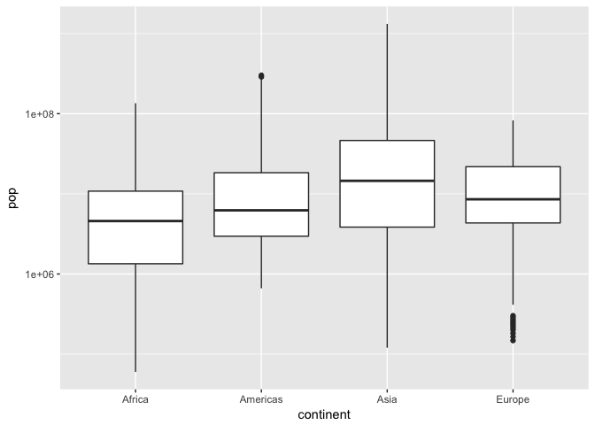
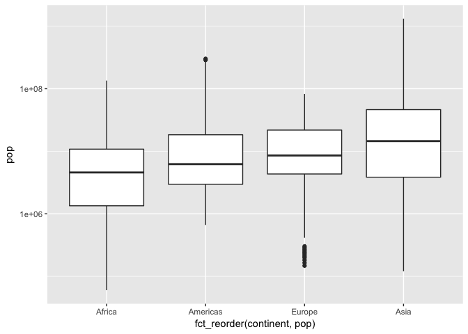
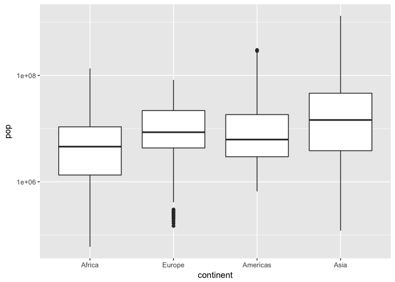

Hw05
================

Table of Content
================

-   Factor management
    -   Factorise. Transform some of the variable in the singer\_locations dataframe into factors: pay attention at what levels you introduce and their order. Try and consider the difference between the base R as.factor and the forcats-provided functions [here](#header1)
    -   Drop Oceania. Filter the Gapminder data to remove observations associated with the continent of Oceania. Additionally, remove unused factor levels. Provide concrete information on the data before and after removing these rows and Oceania; address the number of rows and the levels of the affected factors [here](#header2)
    -   Reorder the levels of country or continent. Use the forcats package to change the order of the factor levels, based on a principled summary of one of the quantitative variables. Consider experimenting with a summary statistic beyond the most basic choice of the median [here](#header3)
-   n

Just to show the difference between as.factor() and forcats as\_factor() I have considered using singer\_location data but for all the rest I have used the gapminder data itself.

``` r
library(singer)
library(gapminder)
library(tidyverse)
library(forcats)
```

Factor management
-----------------

<a name=header1> </a>

### Factorise. Transform some of the variable in the singer\_locations dataframe into factors: pay attention at what levels you introduce and their order. Try and consider the difference between the base R as.factor and the forcats-provided functions

``` r
new_set <- singer_locations %>% mutate(title_forcats_factor = as_factor(title), title_base_factor = as.factor(title))
knitr::kable(head(levels(new_set$title_forcats_factor),10))
```

    ## Warning in kable_markdown(x = structure(c("The Conversation (Cd)", "Lonely
    ## Island", : The table should have a header (column names)

|                             |
|:----------------------------|
| The Conversation (Cd)       |
| Lonely Island               |
| Here's That Rainy Day       |
| Rego Park Blues             |
| Games                       |
| More Pipes                  |
| out OF my MIND              |
| Endlich Ein Grund Zur Panik |
| I Am A Rock                 |
| A perfect world             |

``` r
knitr::kable(head(levels(new_set$title_base_factor),10))
```

    ## Warning in kable_markdown(x = structure(c("¿ Cómo_ cuándo y porqué ( Why do
    ## I love you so )", : The table should have a header (column names)

|                                                               |
|:--------------------------------------------------------------|
| ¿ Cómo\_ cuándo y porqué ( Why do I love you so )             |
| ... Rage                                                      |
| ...And Embarked On a Life of Poverty and Freedom...           |
| .3 (album version)                                            |
| ······                                                        |
| 's Nachts Wanneer Ik Waak                                     |
| 'T Is Nooit Te Laat                                           |
| (And) Then He Kissed Me                                       |
| (Bring Back) Sweet Soul Music                                 |
| (Can I) Find The Right Words (To Say) (2001 Digital Remaster) |

``` r
knitr::kable(head(new_set$title,10))
```

    ## Warning in kable_markdown(x = structure(c("The Conversation (Cd)", "Lonely
    ## Island", : The table should have a header (column names)

|                             |
|:----------------------------|
| The Conversation (Cd)       |
| Lonely Island               |
| Here's That Rainy Day       |
| Rego Park Blues             |
| Games                       |
| More Pipes                  |
| out OF my MIND              |
| Endlich Ein Grund Zur Panik |
| I Am A Rock                 |
| A perfect world             |

<a name=header2> </a>

### Drop Oceania. Filter the Gapminder data to remove observations associated with the continent of Oceania. Additionally, remove unused factor levels. Provide concrete information on the data before and after removing these rows and Oceania; address the number of rows and the levels of the affected factors.

``` r
nrow(gapminder)
```

    ## [1] 1704

``` r
length(levels(gapminder$continent))
```

    ## [1] 5

``` r
new_set <-gapminder %>% filter(continent != "Oceania") %>% droplevels()
new_set_different <- gapminder %>% filter(continent != "Oceania")
nrow(new_set)
```

    ## [1] 1680

``` r
length(levels(new_set$continent))
```

    ## [1] 4

``` r
length(levels(new_set_different$continent))
```

    ## [1] 5

<a name=header2> </a>

### Reorder the levels of country or continent. Use the forcats package to change the order of the factor levels, based on a principled summary of one of the quantitative variables. Consider experimenting with a summary statistic beyond the most basic choice of the median.

``` r
ggplot(new_set,aes(continent,pop)) + geom_boxplot() + scale_y_log10()
```


``` r
new_set %>%  arrange(pop) %>% ggplot(aes(continent,pop)) + geom_boxplot() + scale_y_log10()
```



``` r
ggplot(new_set,aes(fct_reorder(continent,pop),pop)) + geom_boxplot() + scale_y_log10()
```



``` r
new_set %>% mutate(continent = fct_reorder(continent,pop,mean)) %>% ggplot(aes(continent,pop)) + geom_boxplot() + scale_y_log10() 
```


``` r
new_set %>% mutate(continent = fct_reorder(continent,pop,mean)) %>% arrange(pop) %>% ggplot(aes(continent,pop)) + geom_boxplot() + scale_y_log10()
```



``` r
new_set %>% mutate(continent = fct_reorder(continent,pop,mean)) %>% select(continent) %>% write_csv("continent.csv")

new_set %>% mutate(continent = fct_reorder(continent,pop,mean)) %>% select(continent) %>% saveRDS("continent.rds")

new_set %>% mutate(continent = fct_reorder(continent,pop,mean)) %>% select(continent) %>% dput("continent.txt")

continen_csv <- read_csv("continent.csv")
```

    ## Parsed with column specification:
    ## cols(
    ##   continent = col_character()
    ## )

``` r
continen_RDS <- readRDS("continent.rds")   
continen_txt <- dget("continent.txt")  

comp <- tibble(level_original = head(levels(fct_reorder(new_set$continent,new_set$pop,mean))))
comp
```

    ## # A tibble: 4 x 1
    ##   level_original
    ##            <chr>
    ## 1         Africa
    ## 2         Europe
    ## 3       Americas
    ## 4           Asia

``` r
continen_csv <- continen_csv %>% mutate(continent = factor(continent))
continen_RDS <- continen_RDS %>% mutate(continent = factor(continent))
continen_txt <- continen_txt %>% mutate(continent = factor(continent))
comp %>% mutate(level_csv = head(levels(continen_csv$continent)),level_RDS = head(levels(continen_RDS$continent)),level_txt = head(levels(continen_txt$continent)))
```

    ## # A tibble: 4 x 4
    ##   level_original level_csv level_RDS level_txt
    ##            <chr>     <chr>     <chr>     <chr>
    ## 1         Africa    Africa    Africa    Africa
    ## 2         Europe  Americas    Europe    Europe
    ## 3       Americas      Asia  Americas  Americas
    ## 4           Asia    Europe      Asia      Asia
