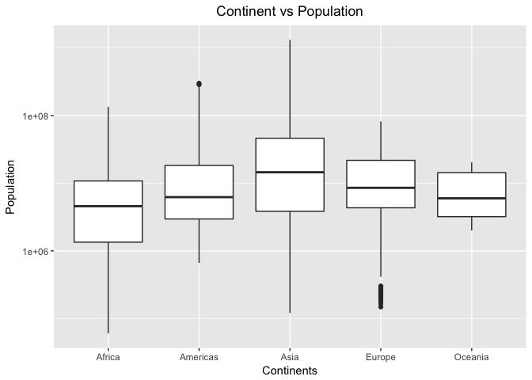
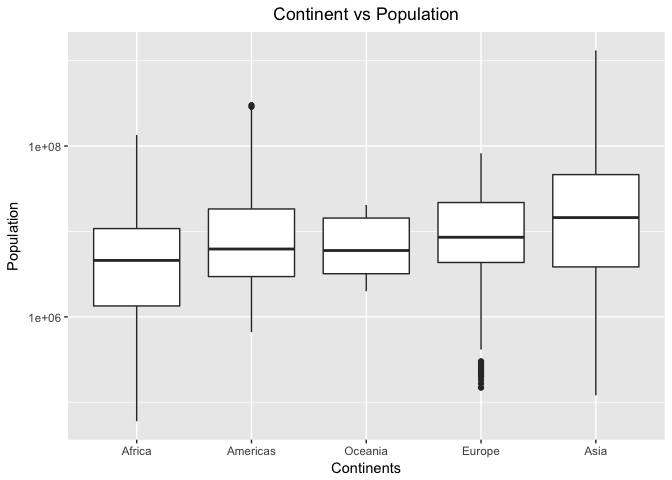
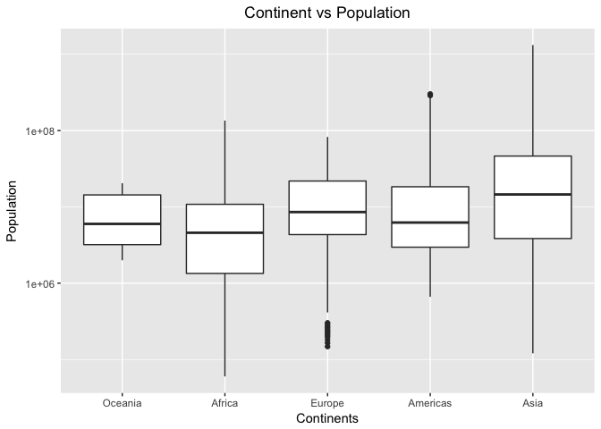
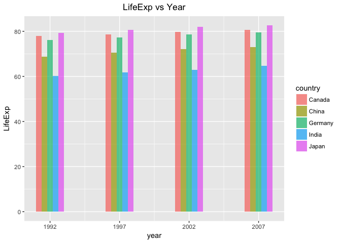
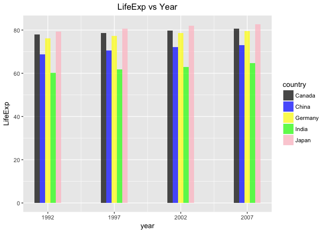
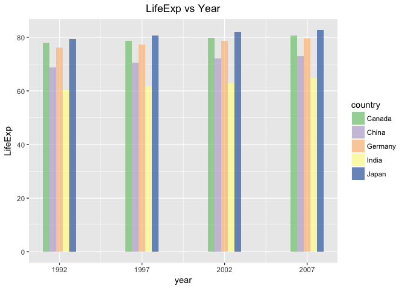
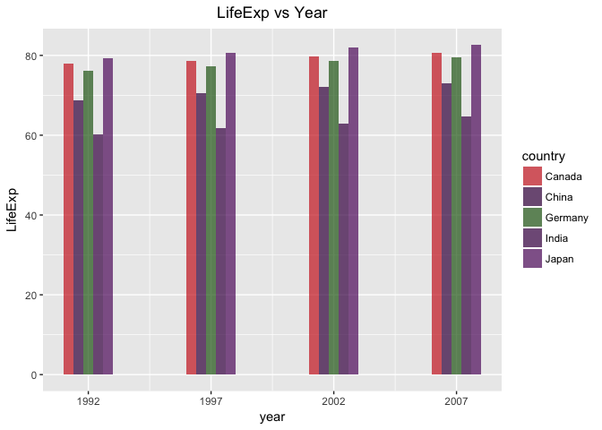
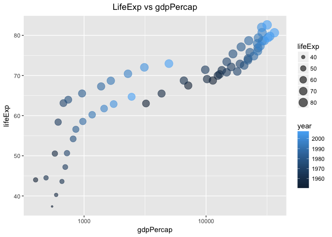
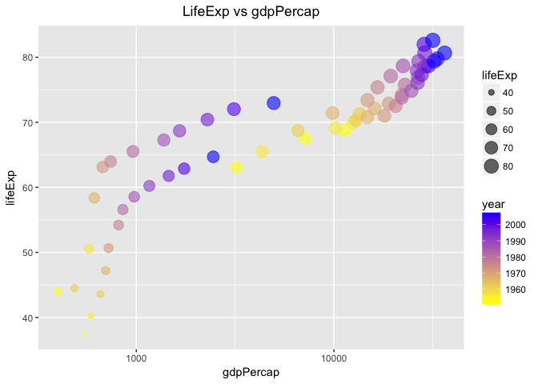
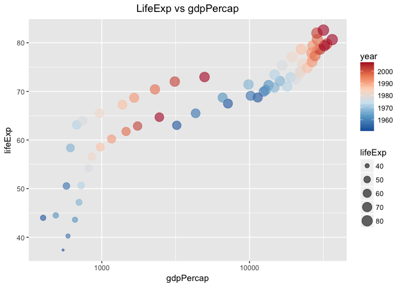

Hw05
================

<a name=HEADER> </a>

Table of Content
================

-   Factor management
    -   Factorise. Transform some of the variable in the singer\_locations dataframe into factors: pay attention at what levels you introduce and their order. Try and consider the difference between the base R as.factor and the forcats-provided functions [here](#header1)
    -   Drop Oceania. Filter the Gapminder data to remove observations associated with the continent of Oceania. Additionally, remove unused factor levels. Provide concrete information on the data before and after removing these rows and Oceania; address the number of rows and the levels of the affected factors [here](#header2)
    -   Reorder the levels of country or continent. Use the forcats package to change the order of the factor levels, based on a principled summary of one of the quantitative variables. Consider experimenting with a summary statistic beyond the most basic choice of the median (This part also involve using different I/O) [here](#header3)
-   Visualization design and Writing figures to file
    -   Qualitative plot [here](#header4)
    -   Sequential plot [here](#header5)
    -   Writing figure to file [here](#header6)

Just to show the difference between as.factor() and forcats as\_factor() I have considered using singer\_location data but for all the rest I have used the gapminder data itself.

``` r
library(singer)
library(gapminder)
library(tidyverse)
library(forcats)
```

Factor management
-----------------

<a name=header1> </a>

### Factorise. Transform some of the variable in the singer\_locations dataframe into factors: pay attention at what levels you introduce and their order. Try and consider the difference between the base R as.factor and the forcats-provided functions

**What I did in Nutshell:**

-   Created new variables title\_forcats\_factor based on forcats library command and title\_base\_factor based on basic r library
-   Compared individual command with actual order of the variable

``` r
new_set <- singer_locations %>% mutate(title_forcats_factor = as_factor(title), title_base_factor = as.factor(title))
```

**Comparing Forcats command with base r command**

-   There is a difference in order of levels by forcats and base r. Base r is based on alphabetical order while the forcats follow the order of variable "title" (Which is clear in next step)

``` r
knitr::kable(list(head(levels(new_set$title_forcats_factor),6),head(levels(new_set$title_base_factor),6)),format = 'markdown',caption = "Comparision factor Command forcats and base")
```

|                       |
|:----------------------|
| The Conversation (Cd) |
| Lonely Island         |
| Here's That Rainy Day |
| Rego Park Blues       |
| Games                 |
| More Pipes            |

|                                                     |
|:----------------------------------------------------|
| ¿ Cómo\_ cuándo y porqué ( Why do I love you so )   |
| ... Rage                                            |
| ...And Embarked On a Life of Poverty and Freedom... |
| .3 (album version)                                  |
| ······                                              |
| 's Nachts Wanneer Ik Waak                           |

**Comparing Forcats command with title variable**

-   We can see that the order of each level created by forcats command is the same as that of actaul title variable

``` r
knitr::kable(list(head(levels(new_set$title_forcats_factor),6),head(new_set$title,6)),format = 'markdown',caption = "Comparision factor Command forcats and base")
```

|                       |
|:----------------------|
| The Conversation (Cd) |
| Lonely Island         |
| Here's That Rainy Day |
| Rego Park Blues       |
| Games                 |
| More Pipes            |

|                       |
|:----------------------|
| The Conversation (Cd) |
| Lonely Island         |
| Here's That Rainy Day |
| Rego Park Blues       |
| Games                 |
| More Pipes            |

**Comapring Base r command with title vaiable**

-   The levels created by base r are different to those of variable "title", they are arranged in alphabetical order

``` r
knitr::kable(list(head(levels(new_set$title_base_factor),6),head(new_set$title,6)),format = 'markdown',caption = "Comparision factor Command forcats and base")
```

|                                                     |
|:----------------------------------------------------|
| ¿ Cómo\_ cuándo y porqué ( Why do I love you so )   |
| ... Rage                                            |
| ...And Embarked On a Life of Poverty and Freedom... |
| .3 (album version)                                  |
| ······                                              |
| 's Nachts Wanneer Ik Waak                           |

|                       |
|:----------------------|
| The Conversation (Cd) |
| Lonely Island         |
| Here's That Rainy Day |
| Rego Park Blues       |
| Games                 |
| More Pipes            |

To go back to Table of Content [here](#HEADER)

<a name=header2> </a>

### Drop Oceania. Filter the Gapminder data to remove observations associated with the continent of Oceania. Additionally, remove unused factor levels. Provide concrete information on the data before and after removing these rows and Oceania; address the number of rows and the levels of the affected factors.

**What I did in Nutshell:**

-   Created two sets in one removed both Oceanina and its corresponding level and called it "new\_set" while the second set with just Oceania removed but not level and called it "new\_set\_different"

*Total number of rows in original gapminder*

``` r
nrow(gapminder)
```

    ## [1] 1704

*Total number of levels of continent*

``` r
length(levels(gapminder$continent))
```

    ## [1] 5

*Filtering gapminder by removing Oceania along with its level*

``` r
new_set <-gapminder %>% filter(continent != "Oceania") %>% droplevels()
```

*Filtering gapminder by removing Oceania but not its level*

``` r
new_set_different <- gapminder %>% filter(continent != "Oceania")
```

*Total number of rows in set with Oceania removed*

``` r
nrow(new_set)
```

    ## [1] 1680

*Total number of levels of continent in new set with both oceania and level removed*

``` r
length(levels(new_set$continent))
```

    ## [1] 4

*Total number of levels of continent in new set with both oceania but level intact*

``` r
length(levels(new_set$continent))
```

    ## [1] 4

``` r
length(levels(new_set_different$continent))
```

    ## [1] 5

To go back to Table of Content [here](#HEADER)

<a name=header3> </a>

### Reorder the levels of country or continent. Use the forcats package to change the order of the factor levels, based on a principled summary of one of the quantitative variables. Consider experimenting with a summary statistic beyond the most basic choice of the median (This part also involve using different I/O)

**What i did in Nutshell:**

-   Plotted box plot of continent vs population (taking log scale at y)

``` r
new_set <-gapminder
ggplot(new_set,aes(continent,pop)) + geom_boxplot() + scale_y_log10("Population") + scale_x_discrete("Continents") + labs(title="Continent vs Population") + theme(plot.title = element_text(hjust=0.5)) 
```



-   Arranged the data using population and plotted again
-   Its clear no change is observed even after using arrange

``` r
new_set %>%  arrange(pop) %>% ggplot(aes(continent,pop)) + geom_boxplot() + scale_y_log10("Population") + scale_x_discrete("Continents") + labs(title="Continent vs Population") + theme(plot.title = element_text(hjust=0.5)) 
```


-   Again plotted continent vs pop but this time arranging corresponding factors of continents based on the median population
    -   Its clearly evident that the order of continents changed in the plot with increasing order of median population of each continent

``` r
ggplot(new_set,aes(fct_reorder(continent,pop),pop)) + geom_boxplot() + scale_y_log10("Population") + scale_x_discrete("Continents") + labs(title="Continent vs Population") + theme(plot.title = element_text(hjust=0.5)) 
```



-   Again plotted continent vs pop but this time arranging corresponding factors of continents based on the mean population
    -   Just like above case order of continent is different than that without arranging factors

``` r
new_set %>% mutate(continent = fct_reorder(continent,pop,mean)) %>% ggplot(aes(continent,pop)) + geom_boxplot() + scale_y_log10("Population") + scale_x_discrete("Continents") + labs(title="Continent vs Population") + theme(plot.title = element_text(hjust=0.5)) 
```



-   This time arranged the data with increasing population after arranging the factors based on mean population and as expected there is no change in graph (its exactly similar to the previous case)

``` r
new_set %>% mutate(continent = fct_reorder(continent,pop,mean)) %>% arrange(pop) %>% ggplot(aes(continent,pop)) + geom_boxplot() + scale_y_log10("Population") + scale_x_discrete("Continents") + labs(title="Continent vs Population") + theme(plot.title = element_text(hjust=0.5)) 
```


-   Saved the data of continent after arranging the factors based on the mean of population in "csv", "rds", "txt" format

``` r
new_set %>% mutate(continent = fct_reorder(continent,pop,mean)) %>% select(continent) %>% write_csv("continent.csv")

new_set %>% mutate(continent = fct_reorder(continent,pop,mean)) %>% select(continent) %>% saveRDS("continent.rds")

new_set %>% mutate(continent = fct_reorder(continent,pop,mean)) %>% select(continent) %>% dput("continent.txt")
```

-   Loaded these saved files in the new variables (continen\_csv,continen\_RDS,continen\_txt)

``` r
continen_csv <- read_csv("continent.csv")
```

    ## Parsed with column specification:
    ## cols(
    ##   continent = col_character()
    ## )

``` r
continen_RDS <- readRDS("continent.rds")   
continen_txt <- dget("continent.txt")  
```

-   Created a new tibble with head of levels in the original continent variable arranged based on mean population (Original levels)

``` r
comp <- tibble(level_original = head(levels(fct_reorder(new_set$continent,new_set$pop,mean))))
```

-   Compared the order of levels from three files (csv,rds and txt) with original to see which saving command is able to retain the original levels
    -   It is clear that except write\_csv, saveRDS and dput are able to retain the original leveling order of the continent

``` r
continen_csv <- continen_csv %>% mutate(continent = factor(continent))
continen_RDS <- continen_RDS %>% mutate(continent = factor(continent))
continen_txt <- continen_txt %>% mutate(continent = factor(continent))
knitr::kable(comp %>% mutate(level_csv = head(levels(continen_csv$continent)),level_RDS = head(levels(continen_RDS$continent)),level_txt = head(levels(continen_txt$continent))))
```

| level\_original | level\_csv | level\_RDS | level\_txt |
|:----------------|:-----------|:-----------|:-----------|
| Oceania         | Africa     | Oceania    | Oceania    |
| Africa          | Americas   | Africa     | Africa     |
| Europe          | Asia       | Europe     | Europe     |
| Americas        | Europe     | Americas   | Americas   |
| Asia            | Oceania    | Asia       | Asia       |

To go back to Table of Content [here](#HEADER)

Visualization design and Writing figures to file
------------------------------------------------

``` r
library(RColorBrewer)
```

<a name=header4> </a>

### Qualitative plot

**The basic bar plot for further analysis**

-   Filtered following countries (Canada,India,China.Japan and Germany) along with the years after 1990
-   Plotted bar graph with x axis as years and y axis as lifeExp, filled the bars based on countries

``` r
p1 <- gapminder %>% 
  filter((country%in%c("Canada","India","China","Japan","Germany") & (year>1990))) %>%
  ggplot(aes(year)) + geom_bar(aes(weight=lifeExp,fill=country),position = "dodge",width=2,alpha=0.7) + scale_y_continuous("LifeExp") + labs(title="LifeExp vs Year") + theme(plot.title=element_text(hjust=0.5)) + scale_x_continuous(breaks = c(1992,1997,2002,2007))
print(p1)
```



**Bar plot colour scheme changed based manual values**

``` r
colourid <- c("black","blue","yellow","green","pink")
p1 + scale_fill_manual(values=colourid)
```



**Bar plot colour scheme changed based values from the palettes from the brewer package**

``` r
p1 + scale_fill_manual(values=brewer.pal(5,"Accent"))
```



**Bar plot colour scheme changed based values from country colour scheme which comes along with the gapminder package**

``` r
p1 + scale_fill_manual(values=country_colors)
```



To go back to Table of Content [here](#HEADER)

<a name=header5> </a>

### Sequential plot

**The basic starting plot for further analysis**

-   Filtered following countries (Canada,India,China.Japan and Germany)
-   Plotted scatter plot with x axis as gdpPercap and y axis as lifeExp and size based on lifeExp, filled the points based on year

``` r
p2 <- gapminder %>% 
  filter(country%in%c("Canada","India","China","Japan","Germany")) %>%
  ggplot(aes(gdpPercap,lifeExp,size=lifeExp)) + geom_point(aes(colour=year),alpha=0.6) + labs(title="LifeExp vs gdpPercap") + scale_x_log10() + theme(plot.title = element_text(hjust=0.5))
print(p2) 
```



**Scatter plot colour scheme changed based manual values**

``` r
p2 + scale_colour_gradient(low="yellow",high="blue")
```



**Scatter plot colour scheme changed based values from the palettes from the brewer package**

``` r
p2 + scale_colour_distiller(palette = "RdBu")
```



To go back to Table of Content [here](#HEADER)

<a name=header6> </a>

### Writing figures to file

The plots were saved with different dimmensions (width and height) and also with different resolution (dpi)

Following two plots are played with (two plots are taken to show that its important to mention which plot is supposed to be plotted in the argument of ggsave)

``` r
p1 <-p1 + scale_fill_manual(values=country_colors)
p2 <-p2 + scale_colour_gradient(low="yellow",high="blue")
```

-   ggsave without argument of which plot to save
    -   So whichever plot is printed last the ggsave will automatically save that so to use ggsave without argument you need to print the plot and save it before printing any other plot

``` r
print(p1)
```


``` r
ggsave("plot1.png",width = 2,height = 2)
print(p2)
```


``` r
ggsave("plot2.png",width = 4,height = 4)
```

The figure for plot1 is:


The figure for plot2 is: 

-   Playing around with dimensions:

``` r
ggsave("scatter1.png",p1,width = 4,height = 4)
```


``` r
ggsave("scatter2.png",p1,width = 9,height = 4)
```


``` r
ggsave("scatter3.png",p1,width = 4,height = 9)
```


-   Playing with Resolution (dpi)

``` r
ggsave("scatter4.png",p1,width = 8,height = 8, dpi=300)
```


``` r
ggsave("scatter5.png",p1,width = 8,height = 8, dpi=500)
```


To go back to Table of Content [here](#HEADER)
